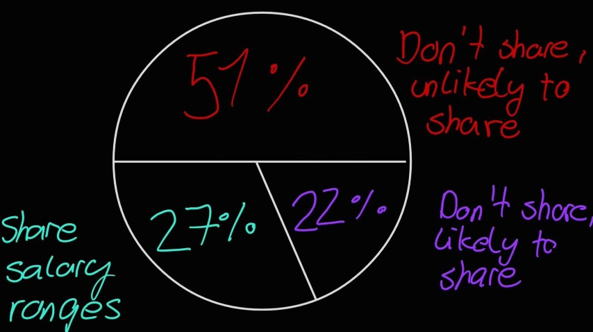
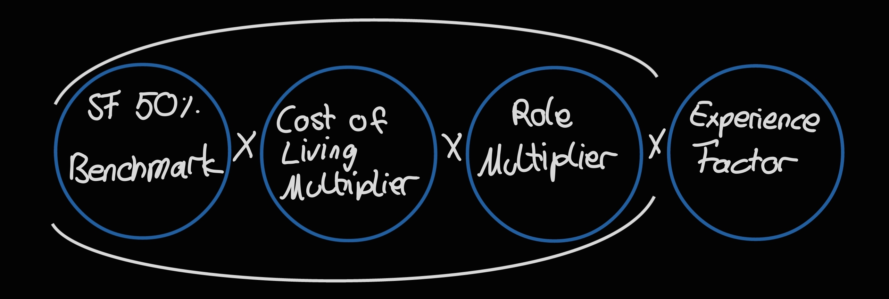
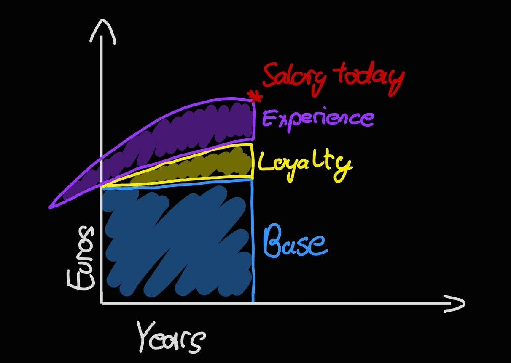
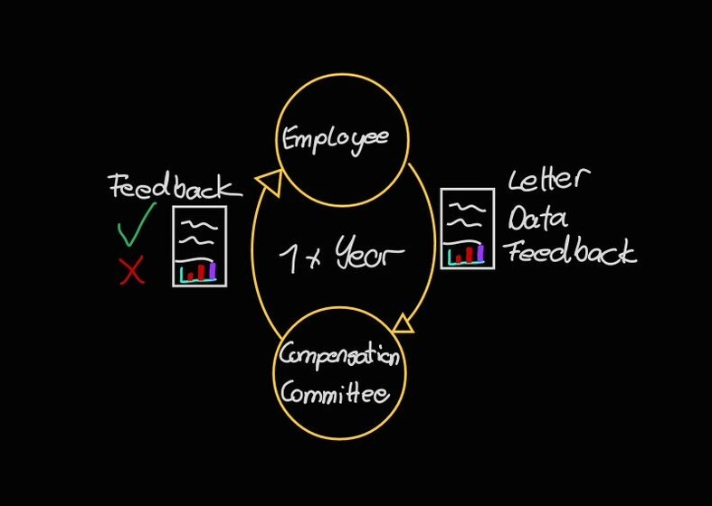

## Salary Transparency - A big Yes(👍) or No (👎)?

 
 
Presented by

#####  Thomas Bernard & Nitin Kaushik 

---

_27%_ of _5000_ employees surveyed says their company currently shares Salary Ranges with employees, candidates or both."
 
 

#####  _,,LinkedIn’s Global Talent Trends, 2019''_ 

---

## Why Sharing Salary is a Good Idea?

---

## Streamlined Salary Negotiation Process

- _34%_ professionals of who don’t disclose salaries - concerned with limited negotiations

- _57%_ agree they have more streamlined negotiations

---

## Fair Pay

- _55%_ professional agrees

- Building Trust

 _,,Sharing salary can remove inequalities and close the gap, also leading to equal gender-pay''._

---

## Streamlined Recruitment Process

- _54%_ respondent from pay-transparent companies agrees
   
   
   ,,empowering candidates to self-select out of the recruitment process early" 

---

## Employee Engagement

- _51%_, agrees sharing salary range allows them to cover other things during the interview.

- _31%_, HR professional who do not share salary range - worry interview dwell too much on negotiations.

---

## Do Businesses dwell on Transparency ?

 

 _,,A Hays’s survey in 2017 discovered that 71% of employees are willing to sacrifice parts of their salary for the right company culture"_ 

---

---

## Buffer Salary System

 _CORE VALUE : "Default to Transparency"_ 

In _2013_, Buffer - a social media management company, made all its employee salaries public.
   

 _,,There were so many unknowns, Scared - says Carolyn Kopprash, Chief happiness officer, Buffer”._ 

---

## Buffer Values

## 

---

## Salary Formula 3.0

    - SF 50% Benchmark - San Francisco 50th percentile market rate
    - Cost of Living Multiplier - Numbeo data to find geographic
                                  bands based on living area cost
    - Role Multiplier - Contributor to salary progression & Seniority
    - Experience Factor - Applicable experience level
    - Other Factors - Dependent grant and Salary choice option

 Note : _The New Formula Isn’t Based on Location_ 

---

## Buffer Salaries 2021

Full list is available at : [Buffer Salaries 2021](https://docs.google.com/spreadsheets/d/11s9VSyf4yaYUsqBKLaVH78NL8wdl8gXoj5BGAzjIFuc/edit#gid=671465451)

---

---

## Growing Horizontally or Vertically?

Buffer’s new unified career framework made career progression transparent :

    1.Levels: Large, distinct steps in Knowledge, Role complexity
               and Scope.
    2. Steps: Smaller milestones in terms of ownership and initiative.

## 

---

## Transparency at Buffer

    -Finances and salaries
        -Salary calculator
        -Salary formula
        -Team salaries
        -Revenue dashboard
    -Workplace culture
        -Open source code
        -Open blog
        -Remote work
        -Diversity dashboard
        -Values
    -Business and SaaS strategy
        -Product roadmap‍
    -End of year reports
        -2016
        -2017
        -2018
    -Equal pay report
        -2017
        -2018
        -2019
        -2020

---

## Sipgate :telephone_receiver:

🏢 Telecommunication company

🌐 Located in Düsseldorf

👩👨 200 employees

---

## Sipgate Lean Salary Framework

Market-oriented approach

No individual negotiation but individual salaries

More transparency leads to less discussion

Salary raise each year for all

---

## Factors

1. **Role factor** based on market analysis

2. **Local Points** based on the plant location

3. **Currency Factor** (10€)

4. **Role Fixum** for everybody (1000€)

5. **Loyalty** based on company affiliation

6. **Experience** based on field of knowledge

   _Factor 5 & 6 are frozen after 15 years_

---

## Additional Factors

Studied and non-studied earn the same but studying costs time so if you study you lose time that you could have gathered for factor Loyalty & Experience:

- plus 2000€ for a bachelors degree

- plus 4000€ for a masters degree

- plus X per day for on-call service

---

---

## Pros and Cons List

---

## 💶 Welcome to Morning Star, how much money would you like to earn? 💵

---

## What are the first things that come to mind?

**Employees will take advantage of this!**

**How do we know if the payment is appropriate?**

**Do we now live in anarchy?**

---

## Morning Star

🏢 Chicago-based investment research firm

📈 Fund, stock and market data analysts

🔧 Provide internet, software & printed-based products for individual customer groups

👩👨 close to 8000 employees

---

## Morning Star salary system

---

Summary of all systems

---

## Limitations

- Flattened Salary Structure
- Resentment from performance based culture companies
- Personal considerations
- Additional burden on budget
- Developing a fair formula
- Negative effect on job performance

---

## References

1. https://business.linkedin.com/talent-solutions/blog/trends-and-research/2019/4-reasons-it-pays-to-share-salary-ranges-according-to-companies-that-do
2. https://business.linkedin.com/talent-solutions/blog/2015/03/what-happened-when-these-companies-made-their-employee-salaries-public
3. https://business.linkedin.com/talent-solutions/blog/trends-and-research/2019/why-these-3-companies-are-sharing-how-much-their-employees-make
4. https://docs.google.com/spreadsheets/d/11s9VSyf4yaYUsqBKLaVH78NL8wdl8gXoj5BGAzjIFuc/edit#gid=671465451
5. https://buffer.com/resources/salary-formula-changes-2019/
6. https://buffer.com/resources/salary-formula/
